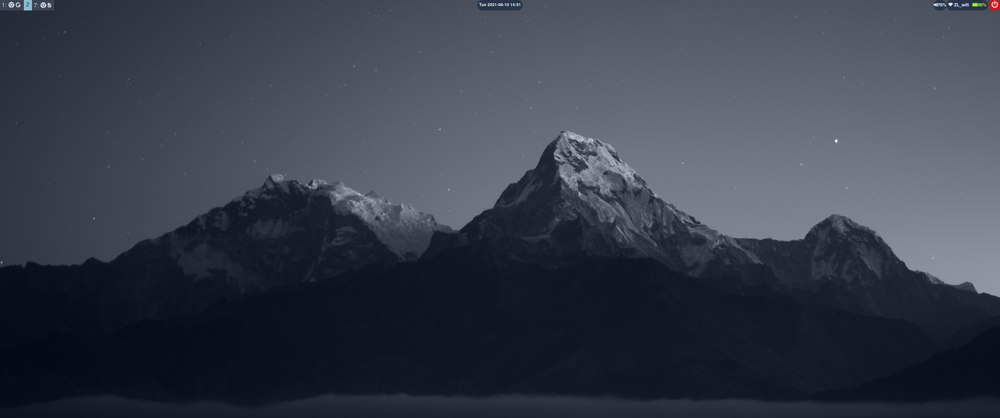
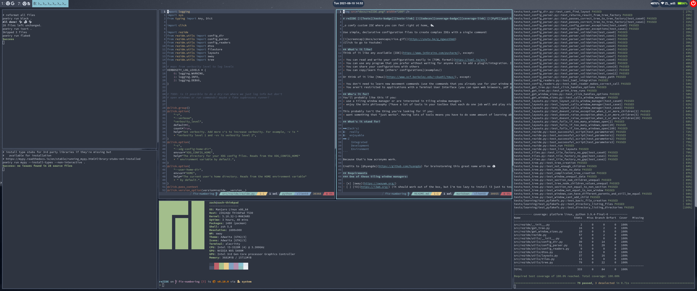
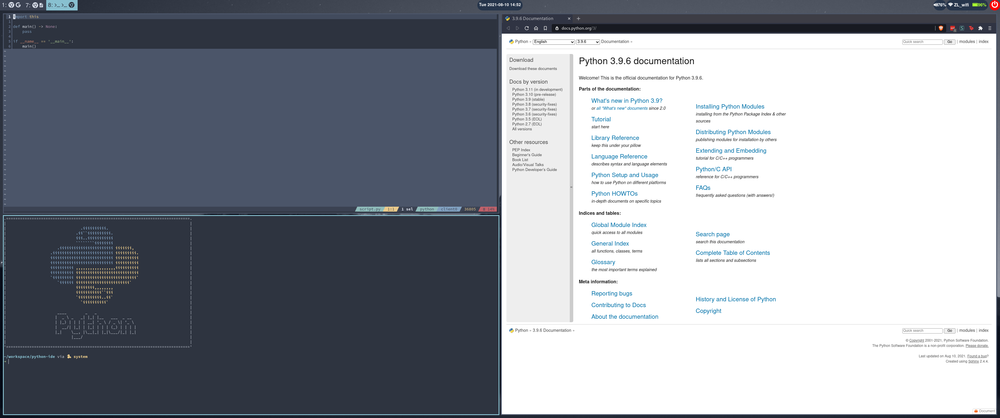

## Oh hi 👋
Didn't see you there. Come in come in! Help yourself to some snacks 🍰; feel free to pet my dog 🐕. His name is Zach Jr.

Now that you're all settled in, would you like a tour of my profile? Let's go! 😄

## my current project ⭐
[reZIDE][rezide] 

## my setup 🖥️
I love customizing my computer setup. I'm always learning about new tools and [browsing the internet for inspiration](https://reddit.com/r/unixporn).

Here are some screenshots of my current setup:

If you'd like to see some of the things that make my setup look cool:
* [dotfiles][dotfiles]
* [my utility scripts][utils]
* [creating automatic IDE-like environments][rezide]

<!--
**abstractlyZach/abstractlyZach** is a ✨ _special_ ✨ repository because its `README.md` (this file) appears on your GitHub profile.

Here are some ideas to get you started:

- 🔭 I’m currently working on ...
- 🌱 I’m currently learning ...
- 👯 I’m looking to collaborate on ...
- 🤔 I’m looking for help with ...
- 💬 Ask me about ...
- 📫 How to reach me: ...
- 😄 Pronouns: ...
- ⚡ Fun fact: ...
-->

[rezide]: https://github.com/abstractlyZach/reZIDE
[dotfiles]: https://github.com/abstractlyZach/dotfiles
[utils]: https://github.com/abstractlyZach/utils
